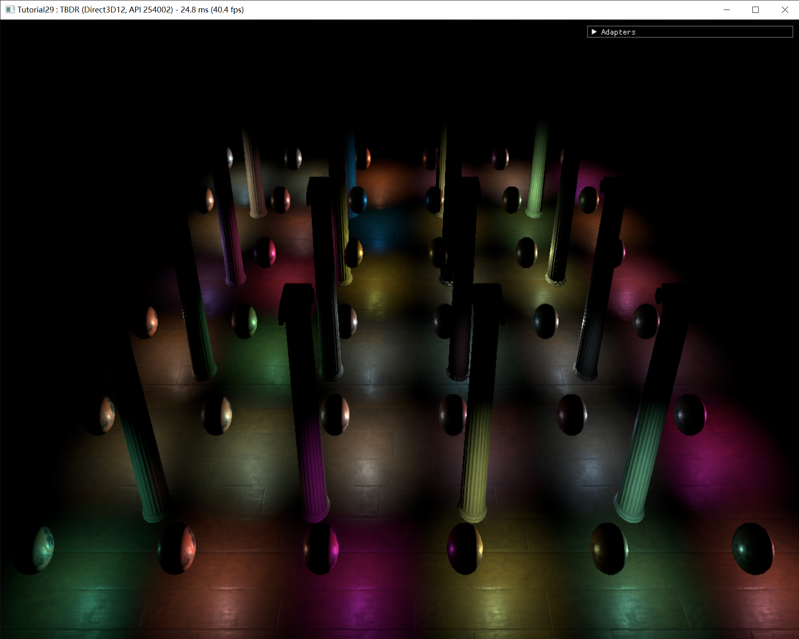
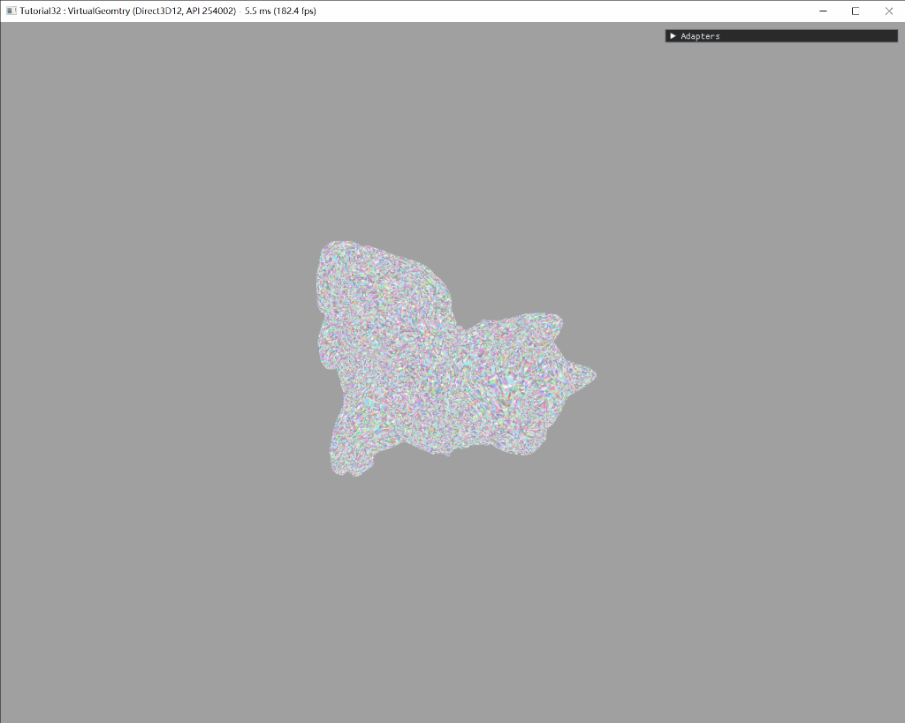
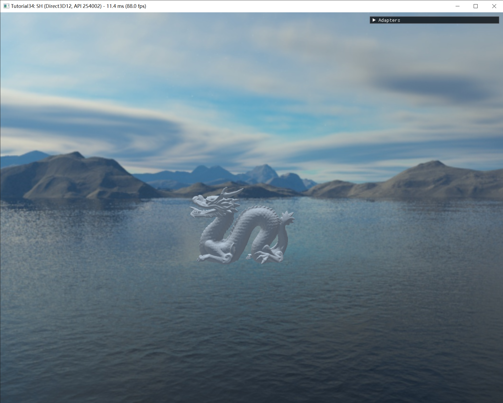
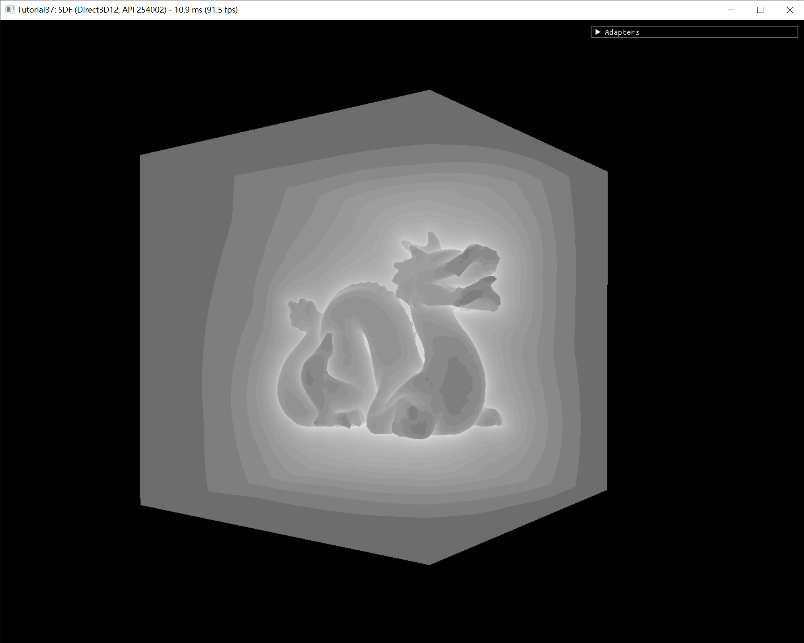

# DiligentSamples 

# Tutorials

## [Tutorial 27 - SSR](Tutorials/Tutorial27_SSR)

延迟渲染 PBR IBL SSR 

## [Tutorial 28 - GPU-Driver](Tutorials/Tutorial28—GPUDriver)

目前还有一些问题

## [Tutorial 29 - TBDR](Tutorials/Tutorial29_TBDR)

延迟渲染 TBDR SSAO Blur TAA

## [Tutorial 30 - VirtualTexture](Tutorials/Tutorial30_VirtualTexture)

目前还有一些问题

## [Tutorial 32 - VirtualGeomtry](Tutorials/Tutorial32_VirtualGeomtry)

VirtualGeomtry 离线生成Cluster和Cluster Group

## [Tutorial 33 - RSM](Tutorials/Tutorial33_RSM)

RSM

## [Tutorial 34 - SH](Tutorials/Tutorial34_SH)

Cube Map   SH(Spherical harmonic)   prt

## [Tutorial 35 - LPV](Tutorials/Tutorial35_LPV)

目前还有一些问题

## [Tutorial 36 - VXGI](Tutorials/Tutorial36_VXGI)

目前还有一些问题

## [Tutorial 37 - SDF](Tutorials/Tutorial37_SDF)

SDF生成和SDF可视化

